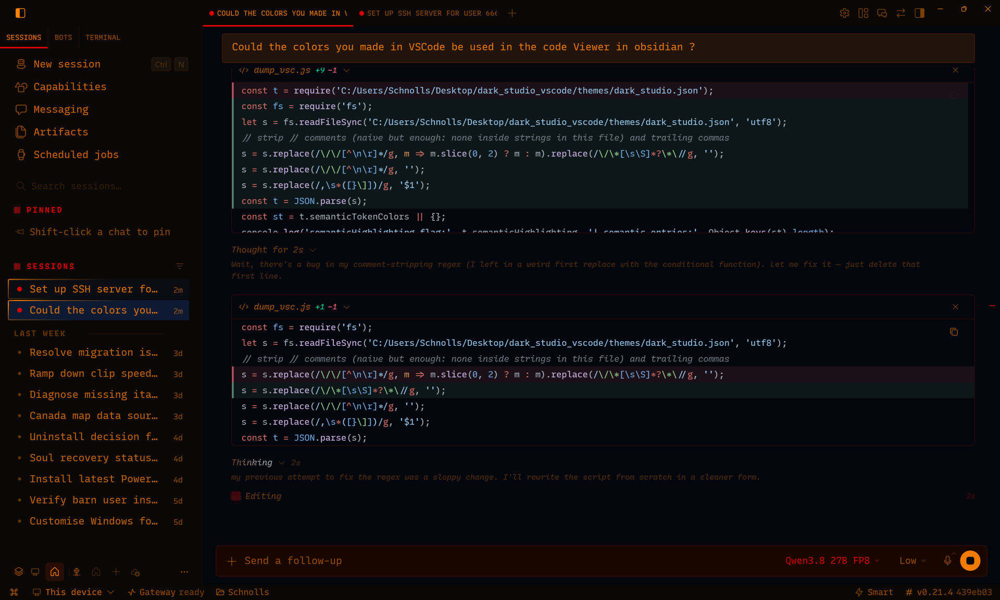

# Hermes Dark Studio

A dark, warm theme for the Hermes desktop app — the
[Dark Studio](https://github.com/barnacker/dark_studio) palette,
tuned for the desktop.



## Install

### 1. Copy this line

```
hermes://plugin-desktop/install?repo=barnacker/hermes_dark_studio&force=true
```

### 2. Paste it into a browser's address bar and press Enter

The desktop app catches the link and opens its install dialog.
Click to confirm — it installs from `master`.

> The link is shown as text because GitHub doesn't render `hermes://`
> links as clickable. You still click once, in the app's confirm dialog.

### 3. Apply it

In the app: **⌘K** (Windows: **Ctrl+K**) → **Theme: apply Dark Studio**
(or pick it in **Appearance**).

That's the whole install. No terminal, no file copying.

Done. The look is stored on the machine running the app.

## Font (recommended)

The theme's letterforms come from **RecMono Duotone Nerd Font** — the
proportional (Propo) cut for the UI, the tabular (Mono) cut for code.
Install it and the theme looks as intended; without it the stack falls
through to system monospace and the character is lost.

- **One package.** [Nerd Fonts 3.5.1](https://github.com/ryanoasis/nerd-fonts/releases/tag/v3.5.1) →
  `Recursive.tar.xz` — 12 `RecMonoDuotoneNerdFont…` TTFs (Duotone, 3 cuts ×
  4 each, plus the other 3 RecMono shapes).
- **Windows:** right-click Duotone's three families —
  `RecMonoDuotoneNerdFontPropo-*.ttf` (proportional),
  `RecMonoDuotoneNerdFontMono-*.ttf` (tabular),
  `RecMonoDuotoneNerdFont-*.ttf` (base) → **Install for all users**.
- **macOS:** `brew install --cask font-recursive-mono-nerd-font`.
- **Linux:** copy the TTFs to `~/.fonts`, `fc-cache -f`.
- **Verify:** the family names are what the TTFs declare —
  `RecMonoDuotone Nerd Font Propo` and `RecMonoDuotone Nerd Font Mono`
  (not the file names).

## Updating later

Paste the same line again (step 1–2). It carries `force`, so the
dialog reinstalls over the current version. Re-apply the theme in
Appearance if the app doesn't refresh by itself.

## Other ways to install

If you can't use a browser (or prefer the command line):

### Clone + installer (Windows)

```powershell
git clone https://github.com/barnacker/hermes_dark_studio
cd hermes_dark_studio
.\install.ps1
```

The script copies `plugin.js` to the right place.

### Copy the file by hand (any OS)

Copy the repo's `plugin.js` into a folder called
`hermes_dark_studio` inside the app's plugins directory:

```
<hermes-home>/desktop-plugins/hermes_dark_studio/plugin.js
```

`<hermes-home>` is `$HERMES_HOME` if set, otherwise:

- Windows: `%LOCALAPPDATA%\hermes`
- macOS / Linux: `~/.hermes`

The app shows the exact folder under **Settings → Plugins**.
Then **⌘K → Reload desktop plugins** (first install only), and apply
the theme as in step 3 above.

## Editing

Open `plugin.js`, change a value in the `V` table near the top, save.
The plugin hot-reloads; run the ⌘K apply command again.

What each value controls:

- **Composer / inputs** — `card` (fill), `foreground` (text),
  `mutedForeground` (placeholder), `border` / `input` (idle outline),
  `composerRing` (focus ring)
- **User message bubbles** — `bubble`, `bubbleBorder`
- **Sidebars** — `sidebar`, `sidebarBackground`, `sidebarBorder`
- **Menus / dropdowns** — `popover`, `popoverForeground`
- **Errors, Stop button** — `danger`
- **Composer field** — `composerField` (maroon) and `composerText`
  (red), applied to the composer only
- **Terminal pane** — the `ANSI` block

Every value stays in `#RRGGBB` form.

## File map

| File | What it is |
|---|---|
| `plugin.js` | The whole theme — an editable `V` table at the top,
  each hex annotated with its Dark Studio palette variable and the
  element it paints. Registers the theme + two ⌘K commands (apply,
  copy palette JSON) + the composer/field styling. |
| `install.ps1` | One-shot installer for Windows. |

## Notes

- The name `dark-studio` must not collide with a built-in desktop
  theme id (`nous`, `mono`, `slate`, `cyberpunk`, `midnight`, `ember`).
- The UI face is **RecMonoDuotone Nerd Font Propo** (proportional cut) and
  the code face is **RecMonoDuotone Nerd Font Mono** (tabular cut); weight
  rides the font's own ramp (no scoped override). Install itself: the
  **Font** section above.
- This repo is desktop-app theming only; the source palette lives in
  `barnacker/dark_studio`.
